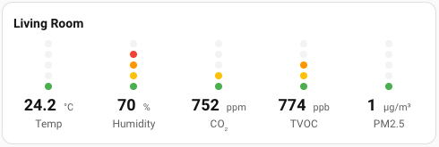

# Home Assistant Awair Element Card
Awair Element–style air quality Lovelace card for Home Assistant, with a built‑in visual editor.



## Features
- Awair‑like dot indicator per metric
- Fully configurable **entities** per column
- Per‑item thresholds & colors (JSON)
- Optional units, precision, compact mode
- **Visual editor** (add items, pick entities)

## Installation

### Via HACS (Recommended)
1. Go to **HACS → Frontend → ⋮ → Custom repositories**
2. Add repository: `https://github.com/aitjcize/lovelace-awair-element-card`
3. Category: **Lovelace**
4. Click **Install** on Awair Element Card
5. **Restart Home Assistant frontend** (no need to manually add resources!)

HACS automatically:
- ✅ Downloads the card to `/hacsfiles/awair-element-card/`
- ✅ Adds resource URL with automatic cache busting
- ✅ Notifies you of updates

### Manual Installation
1. Download `dist/awair-element-card.js` from the [latest release](https://github.com/aitjcize/lovelace-awair-element-card/releases)
2. Copy to `config/www/awair-element-card.js`
3. Add resource in **Settings → Dashboards → Resources**:
   ```
   URL: /local/awair-element-card.js
   Type: JavaScript Module
   ```
4. Hard refresh browser (Ctrl+Shift+R)

## Use

### Simple Configuration (Recommended)
Just map sensor types to your entity IDs. Labels, units, precision, and thresholds are predefined:

```yaml
type: custom:awair-element-card
title: Air Quality
sensors:
  temperature: sensor.living_temp
  humidity: sensor.living_humidity
  co2: sensor.living_co2
  tvoc: sensor.living_tvoc
  pm25: sensor.living_pm25
```

**Override defaults for specific sensors:**

```yaml
sensors:
  temperature: sensor.living_temp
  humidity:
    entity: sensor.living_humidity
    thresholds:
      - {max: 50, color: '#4CAF50'}
      - {max: 70, color: '#FFC107'}
      - {max: 100, color: '#F44336'}
  co2: sensor.living_co2
  tvoc: sensor.living_tvoc
  pm25:
    entity: sensor.living_pm25
    precision: 1
    label: PM 2.5
```

**Predefined Sensor Types** (Based on official Awair standards):
- **temperature** - Temp (°C), 1 decimal
  - 🟣 Extremely cold: <8°C
  - 🔴 Very cold: 8-16°C
  - 🟠 Cold: 16-18°C
  - 🟡 Cool: 18-20°C
  - 🟢 Optimal: 20-25°C
  - 🟡 Warm: 25-27°C
  - 🟠 Hot: 27-29°C
  - 🔴 Very hot: 29-34°C
  - 🟣 Extremely hot: >34°C
- **humidity** - Humidity (%), 0 decimals
  - 🟣 Extremely dry: <14%
  - 🔴 Very dry: 14-23%
  - 🟠 Dry: 23-30%
  - 🟡 Slightly dry: 30-40%
  - 🟢 Optimal: 40-50%
  - 🟡 Slightly humid: 50-60%
  - 🟠 Humid: 60-65%
  - 🔴 Very humid: 65-80%
  - 🟣 Extremely humid: >80%
- **co2** - CO₂ (ppm), 0 decimals
  - 🟢 Excellent: <600
  - 🟡 Moderate: 600-1000
  - 🟠 Poor: 1000-2000
  - 🔴 Bad: 2000-4500
  - 🟣 Hazardous: >4500
- **tvoc** - TVOC (ppb), 0 decimals
  - 🟢 Excellent: <300
  - 🟡 Moderate: 300-500
  - 🟠 Poor: 500-3000
  - 🔴 Bad: 3000-25000
  - 🟣 Hazardous: >25000
- **pm25** - PM2.5 (µg/m³), 0 decimals
  - 🟢 Excellent: <12
  - 🟡 Moderate: 12-35
  - 🟠 Poor: 35-55
  - 🔴 Bad: 55-150
  - 🟣 Hazardous: >150

**Dot Indicators:**
The card displays progressive dots (like the Awair Element). The number of filled dots and their color indicate air quality:
- More dots filled = worse air quality (for pollutants) or further from optimal range (for temp/humidity)
- Color indicates severity: green (excellent) → yellow (moderate) → orange (poor) → red (bad) → purple (hazardous)

### Advanced Configuration (Custom)
For full control over labels, units, precision, and thresholds (legacy format):

```yaml
type: custom:awair-element-card
title: Air Quality
items:
  - label: Temp
    entity: sensor.living_temp
    unit: °C
    precision: 0
    thresholds:
      - {max: 18, color: '#4CAF50'}
      - {max: 26, color: '#FFC107'}
      - {max: 30, color: '#FF9800'}
      - {max: 100, color: '#F44336'}
  - label: Humidity
    entity: sensor.living_humidity
    unit: '%'
  - label: CO₂
    entity: sensor.living_co2
    unit: ppm
```

## Build
```bash
npm i
npm run build
```
Artifacts: `dist/awair-element-card.js` 

## Release
1. `npm version minor` (or patch)
2. Push tags to GitHub
3. Create a Release attaching `dist/awair-element-card.js` 
4. HACS will pick the new version automatically (if added as repo)

## Credit
Designed with love for the HA community by @aitjcize. Inspired by Awair Element UI.
